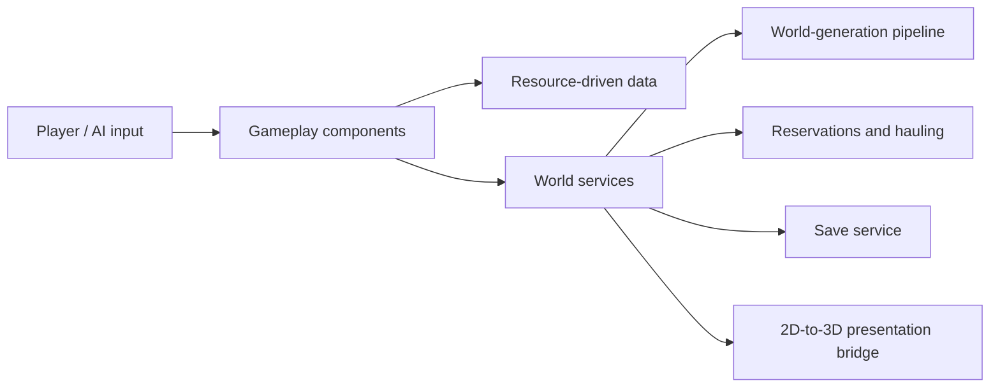
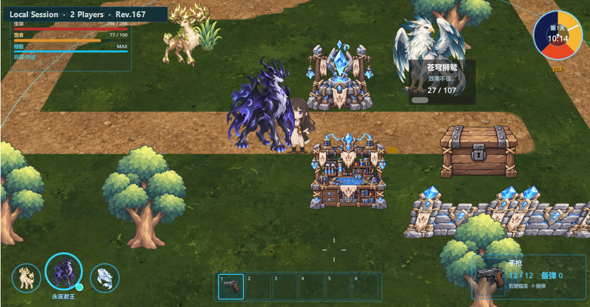

# Biome Epoch

Code showcase for **Biome Epoch (群落纪元)**, a Godot 4.7 2.5D survival, building, and creature-collection game prototype. The project pairs 2D gameplay simulation with a separate 3D presentation layer.

## Overview

Players explore a procedurally generated world, collect resources, build facilities, manage a party and base creatures, and coordinate construction, production, and hauling work. This repository is a deliberately small, review-friendly selection of the original project's implementation code; it is not a runnable game build.

## Gameplay Systems

- Resource gathering, construction placement, production, storage, and hauling.
- A player party, deployable creatures, and autonomous base work.
- Data-driven world resources and staged procedural world generation.
- Save/load services for persistent game state.
- A 2D-logic / 3D-presentation bridge for terrain and world entities.

## Technical Highlights

- **Staged world generation:** graph, layout, raster, topology, validation, and presentation preparation are composed through a pipeline instead of a monolithic generator.
- **Grid-aware logistics:** hauling uses reservations and state transitions so autonomous workers do not compete for the same source or destination capacity.
- **Explicit scene composition:** cross-system references are assembled at the scene boundary while gameplay state remains within domain components.
- **Coordinate ownership:** 2D-to-3D conversion is centralised in a presentation bridge so gameplay code does not construct render coordinates ad hoc.
- **Regression coverage:** the selected tests exercise world-generation invariants and hauling contracts.

## Architecture

## Selected Code

| Area | File | Why it is included |
| --- | --- | --- |
| Scene composition | [MainSceneComposition](CodeSamples/scripts/main/main_scene_composition.gd) | Wires runtime systems at the composition boundary. |
| World generation | [WorldGenPipeline](CodeSamples/scripts/worldgen/generation/worldgen_pipeline.gd) | Coordinates generation stages and their validation results. |
| Road generation | [WorldGenRoadNetworkGenerator](CodeSamples/scripts/worldgen/generation/worldgen_road_network_generator.gd) | Shows constrained path routing over generated world data. |
| Logistics AI | [CreatureHaulBehavior](CodeSamples/scripts/creatures/behaviors/creature_haul_behavior.gd) | Demonstrates worker flow states, reservations, and recovery paths. |
| Persistence | [SaveGameService](CodeSamples/scripts/save/save_game_service.gd) | Encapsulates save-file lifecycle and error handling. |
| Rendering boundary | [WorldVisualBridge](CodeSamples/scripts/visual/world_visual_bridge.gd) | Centralises the 2D simulation / 3D display coordinate conversion. |
| Tests | [World generation suite](CodeSamples/tests/suites/world_generation_test_suite.gd) and [hauling regression](CodeSamples/tests/haul_architecture_regression.gd) | Representative automated coverage for high-risk systems. |

## Tech Stack

- Godot 4.7
- GDScript
- Forward Plus renderer
- Godot Resources (`.tres`) for data-driven content

## Running the Full Project

The runnable project, game assets, and editor configuration are intentionally kept out of this public code showcase. This repository has no external dependencies and is intended for source review.

## Media

This in-engine capture shows base structures, deployable creatures, the party panel, quick slots, and combat HUD during a local playtest session.
