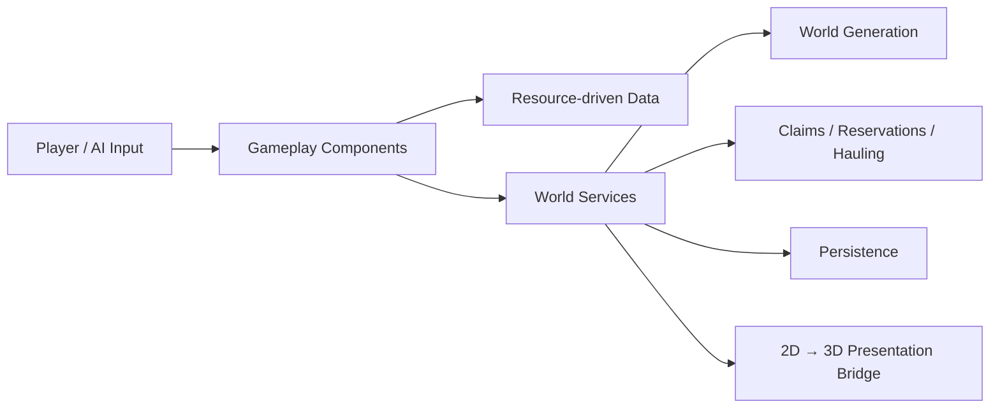

# Biome Epoch

**Biome Epoch (群落纪元)** is a playable Godot 4.7 2.5D survival, building, and creature-collection game prototype.

This repository is a focused code showcase rather than the complete runnable Godot project.

Explore a procedurally generated world, gather resources, build facilities, manage creatures, customize weapons, and coordinate production and logistics across a persistent base.


## Gameplay Showcase

Gathering, crafting, building, creature combat, weapon customization, and boss encounters.

https://github.com/user-attachments/assets/b7942e20-09b6-4312-9294-b540ef1be23e

## Project Highlights

- **Seeded procedural world generation** with graph validation, room ownership, topology enforcement, road routing, biome/era assignment, and safe-spawn selection.
- **Autonomous creature logistics** with source claims, destination-capacity reservations, multi-worker competition, delivery states, and failure recovery.
- **Survival and base-building gameplay** covering gathering, crafting, construction, production, creature deployment, weapons, and combat.
- **Persistent save system** with slot manifests, version checks, temporary-file writes, backup recovery, autosave, and quick-save support.
- **Decoupled 2D simulation and 3D presentation**, keeping gameplay coordinates authoritative while visual systems share a single world-space bridge.
- **Regression coverage** for world generation and hauling, including competing workers, resource shortages, interruptions, and repeated cleanup.

## Playtest Build

**Windows x86_64**

[**Download Biome Epoch Playtest v0.1.0**](https://github.com/hanyanzeduck/biome-epoch-showcase/releases/download/v0.1.0/fera.zip)

Extract the ZIP and run `biome_epoch.exe`.

> This repository is a focused code showcase rather than the complete runnable Godot project.  
> Use the playtest build above to experience the game.

---

## Technical Highlights

### 1. Seeded World Generation

[`WorldGenPipeline.generate()`](CodeSamples/scripts/worldgen/generation/worldgen_pipeline.gd) coordinates the complete generation pipeline:

`graph generation → structural validation → layout retries → workspace fitting → ownership rasterisation → room placement → topology enforcement → roads → spawn selection`

Each stage records elapsed time, and later stages receive independently derived deterministic seeds.

Invalid graphs and layouts return diagnostic results early, allowing inexpensive failures to be rejected before entering the more expensive raster stages.

The final player spawn is selected inside the validated starting room and gameplay boundary, prioritizing local clearance before distance to the room centre.

[`WorldGenRoadNetworkGenerator`](CodeSamples/scripts/worldgen/generation/worldgen_road_network_generator.gd) builds roads inside each task's ownership mask.

For task-to-task links, it finds a real shared tile boundary near the graph anchor and connects that point into the local road network. Routing uses grid BFS with reusable queue and visitation arrays, followed by collinear-point removal and two Chaikin smoothing passes.

---

### 2. Autonomous Creature Logistics

[`CreatureHaulBehavior`](CodeSamples/scripts/creatures/behaviors/creature_haul_behavior.gd) separates hauling into explicit task-resolution, movement, pickup, delivery, and recovery states.

Before travelling, a worker:

1. claims a valid resource source;
2. reserves destination capacity;
3. moves to the source;
4. reconciles the reservation with the quantity actually collected;
5. transports the cargo;
6. performs delivery or recovery.

A loaded worker may collect additional quantities of the same item without exceeding its carrying capacity.

Combat interruptions, return-home requests, blocked paths, removed sources, full storage, removed storage, and partial delivery all have explicit cancellation or reselection paths so that claims, reservations, and cargo are not silently lost.

The public file demonstrates the behaviour orchestration; endpoint resolution, transfer execution, and reservation leases are collaborators defined in the full project.

---

### 3. Persistence and Recovery

[`SaveGameService`](CodeSamples/scripts/save/save_game_service.gd) captures gameplay state through an adapter and writes:

- a versioned world JSON;
- a separate slot manifest;
- temporary `.tmp` files;
- recoverable `.bak` backups.

The service rejects saves created with an incompatible world-generation version rather than replaying an old seed against potentially different generation logic.

Autosave, F5 quick-save, and close-request saving are integrated into the service.

Local saves are disabled for LAN clients, and legacy save data is copied into the new user directory without deleting the original files.

---

### 4. 2D Simulation / 3D Presentation Boundary

Gameplay simulation remains authoritative in 2D world coordinates.

[`WorldVisualBridge`](CodeSamples/scripts/visual/world_visual_bridge.gd) owns the shared conversion:

```text
Vector2(x, y) → Vector3(x, height, y)
```

It also provides:

- inverse world-coordinate conversion;
- screen-to-ground ray projection;
- camera-relative movement directions;
- visibility checks.

[`MainSceneComposition`](CodeSamples/scripts/main/main_scene_composition.gd) connects the player, world runtime, building systems, party systems, and visual presenters at the scene boundary.

This prevents individual gameplay systems from implementing their own camera or world-space conversion logic.

---

## Architecture



The core principle is to keep gameplay simulation authoritative while presentation, persistence, generation, and logistics interact through explicit boundaries.

---

## Selected Code

| Area | File | Suggested review point |
| --- | --- | --- |
| World generation | [WorldGenPipeline](CodeSamples/scripts/worldgen/generation/worldgen_pipeline.gd) | `generate`, stage timings, layout retries, final spawn |
| Road generation | [WorldGenRoadNetworkGenerator](CodeSamples/scripts/worldgen/generation/worldgen_road_network_generator.gd) | BFS routing, task contacts, path simplification and smoothing |
| Logistics AI | [CreatureHaulBehavior](CodeSamples/scripts/creatures/behaviors/creature_haul_behavior.gd) | task acquisition, cargo handling, interruption and recovery |
| Persistence | [SaveGameService](CodeSamples/scripts/save/save_game_service.gd) | `save_slot`, `load_slot`, temporary writes and backup recovery |
| Rendering boundary | [WorldVisualBridge](CodeSamples/scripts/visual/world_visual_bridge.gd) | coordinate conversion, camera projection and input direction |
| Scene composition | [MainSceneComposition](CodeSamples/scripts/main/main_scene_composition.gd) | dependency collection and gameplay/visual binding |
| Tests | [World generation suite](CodeSamples/tests/suites/world_generation_test_suite.gd) | deterministic generation and world invariants |
| Tests | [Hauling regression](CodeSamples/tests/haul_architecture_regression.gd) | competing workers, shortages and failure recovery |

---

## Regression Evidence

The public [hauling regression](CodeSamples/tests/haul_architecture_regression.gd) defines **20 scenarios**, including:

- source shortages;
- destination-capacity shortages;
- source removal;
- destination removal;
- partial delivery;
- work interruption;
- unreachable paths;
- 5 / 10 / 20 competing workers;
- repeated cleanup cycles.

The [world-generation test suite](CodeSamples/tests/suites/world_generation_test_suite.gd) covers:

- seeded generation;
- deterministic repeatability;
- era and biome assignments;
- spawn safety;
- terrain-atlas mappings;
- runtime 3D terrain bindings.

These tests depend on classes, resources, and scenes from the full project and are included here as representative regression code rather than as a standalone executable test suite.

---

## Tech Stack

- **Engine:** Godot 4.7
- **Language:** GDScript
- **Renderer:** Forward Plus
- **Data:** Godot Resources (`.tres`)
- **Platform:** Windows x86_64 playtest build

---

## Repository Scope

This repository is intentionally a **small, review-friendly code showcase** rather than the complete editor project.

The selected implementation and test files reference additional game classes, Resources, scenes, assets, and collaborators that are intentionally omitted from the public repository.

For reviewers:

- use the [Playtest Build](#playtest-build) to experience the game;
- use [Selected Code](#selected-code) to jump directly into representative systems;
- use the technical sections above for implementation context.

The release ZIP contains the playable Windows build, not the project's complete source code.

---

## AI-assisted Engineering Workflow

Biome Epoch is developed with a controlled **ChatGPT + Codex** workflow.

Requirements, gameplay goals, architecture boundaries, system contracts, and acceptance criteria are defined by the developer. AI tools assist with implementation, code search, review, bug investigation, and regression-test design.

Durable project rules and engineering decisions are kept alongside the code so that changes remain constrained and reviewable.

### Engineering Documentation

- [Agent Rules](AGENTS.md)
- [System Specifications](specs/README.md)
- [AI Development Workflow](docs/ai-development.md)
- [Architecture Decision Records](docs/adr/)
- [Agent Skills / Workflows](skills/README.md)
