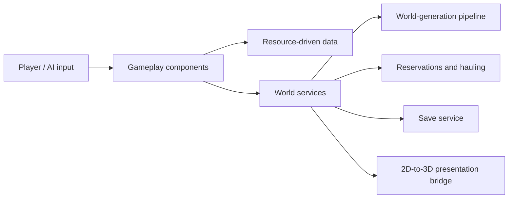

https://github.com/user-attachments/assets/b7942e20-09b6-4312-9294-b540ef1be23e

# Biome Epoch

Code showcase for **Biome Epoch (群落纪元)**, a Godot 4.7 2.5D survival, building, and creature-collection game prototype. The game uses a 2D simulation for world coordinates and a separate 3D presentation layer. This repository shows selected implementation files; the downloadable Windows build is available below.

## What I Built

- A seeded world-generation pipeline that validates a task/room graph, chooses a layout, rasterises ownership and rooms, enforces topology, builds roads, and selects a safe spawn tile.
- Autonomous creature hauling for ground pickups and production output, with source claims, destination-capacity reservations, delivery states, and recovery when endpoints change or movement fails.
- A save service with slot manifests, version checks, temporary-file writes, backup reads, autosave and quick-save hooks.
- A scene-composition boundary and a 2D-to-3D coordinate bridge, so gameplay systems do not each invent their own camera or world-space conversion.
- Regression scenarios for world generation and hauling, including multi-worker competition and repeated state cleanup.

## Overview

Players explore a procedurally generated world, collect resources, build facilities, manage a party and base creatures, and coordinate construction, production, and hauling work. This repository is a deliberately small, review-friendly selection of the original project's implementation code.

## AI-assisted Engineering Workflow

The full Biome Epoch project is developed with a controlled ChatGPT + Codex workflow: requirements and architecture boundaries are set by the developer, while AI assists with implementation, code search, review, bug investigation, and regression-test design. The repository now keeps the durable rules, system contracts, architecture decisions, and repeatable change workflows alongside the code so reviewers can understand how changes are constrained and verified.

### Engineering Docs

- [Agent Rules](AGENTS.md)
- [System Specifications](specs/README.md)
- [AI Development Workflow](docs/ai-development.md)
- [Architecture Decision Records](docs/adr/)
- [Agent Skills / Workflows](skills/README.md)

## Playtest Build

**Windows x86_64:** Download [Biome Epoch Playtest v0.1.0](https://github.com/hanyanzeduck/biome-epoch-showcase/releases/download/v0.1.0/fera.zip), extract the ZIP, then run `fera.exe`.

## Code Walkthrough

### 1. Seeded world generation and road routing

[`WorldGenPipeline.generate()`](CodeSamples/scripts/worldgen/generation/worldgen_pipeline.gd) assembles graph generation, a structural check, inexpensive task-layout retries, workspace fitting, task ownership rasterisation, room placement/partitioning, topology enforcement, validation, boundary construction, roads and spawn selection. It records per-stage elapsed time in the result and derives separate deterministic seeds for later stages. Invalid graphs or layouts return a diagnostic result early; a successful candidate enters the expensive raster stage once. The final spawn is chosen inside the validated start room and gameplay boundary, favouring clearance around the tile before distance to the room centre.

[`WorldGenRoadNetworkGenerator`](CodeSamples/scripts/worldgen/generation/worldgen_road_network_generator.gd) routes room-chain roads inside each task's raster ownership mask. For task-to-task links it finds an actual shared tile boundary near the graph anchor and connects that contact to the local road network. Routing uses grid BFS with reusable queue/visit arrays, then removes collinear points and applies two Chaikin smoothing passes. It deliberately does not turn every graph loop/crosslink into a road.

### 2. Autonomous creature logistics

[`CreatureHaulBehavior`](CodeSamples/scripts/creatures/behaviors/creature_haul_behavior.gd) separates task resolution, movement, pickup, delivery and recovery into explicit flow states. A worker claims a ground pickup or production source **and** reserves destination capacity before travelling. The reserved amount shrinks to the quantity actually collected; a loaded worker can collect more of the same item without exceeding its capacity. Combat, return-home, blocked paths, removed sources, full/removed storage and partial delivery have explicit cancellation or reselection paths, so claims and cargo are not silently lost. Endpoint resolution, transfer execution and reservation leases are collaborators used by this selected file; their full definitions are in the original project, not this excerpt.

### 3. Persistence and rendering boundary

[`SaveGameService`](CodeSamples/scripts/save/save_game_service.gd) captures a gameplay payload through an adapter, writes a versioned world JSON and a separate slot manifest, and uses `.tmp` / `.bak` paths for recoverable writes and reads. It rejects a save whose world-generation version differs from the current generator rather than replaying an old seed into potentially incompatible terrain. Local saves are disabled for a LAN client; autosave, F5 quick-save and close-request saving are wired into the service. Legacy project save files are copied into the new user directory without deleting the originals.

[`WorldVisualBridge`](CodeSamples/scripts/visual/world_visual_bridge.gd) owns the mapping `Vector2(x, y) -> Vector3(x, height, y)`, its inverse, screen-to-ground ray projection, camera-relative input directions and visibility checks. [`MainSceneComposition`](CodeSamples/scripts/main/main_scene_composition.gd) wires the player, world runtime, building/party systems and visual presenters at the scene boundary; it reports missing visual nodes while still binding available parts. This keeps the 2D simulation authoritative and 3D positioning in one presentation interface.

### 4. Regression evidence

The [hauling regression](CodeSamples/tests/haul_architecture_regression.gd) defines 20 scenarios, including source/destination shortages, removals, partial delivery, work interruption, unreachable paths, 5/10/20 competing workers and eight cleanup cycles. The [world-generation suite](CodeSamples/tests/suites/world_generation_test_suite.gd) checks seeded generation, repeatability, era/biome assignments, spawn safety, terrain-atlas mappings and runtime 3D terrain bindings. These files are representative test code; they depend on classes and scenes omitted from this small public selection and cannot be run as a standalone Godot project from this repository.

## Architecture

## Selected Code

| Area | File | Review starting point |
| --- | --- | --- |
| Scene composition | [MainSceneComposition](CodeSamples/scripts/main/main_scene_composition.gd) | `_enter_tree`, dependency collection, visual/gameplay binding. |
| World generation | [WorldGenPipeline](CodeSamples/scripts/worldgen/generation/worldgen_pipeline.gd) | `generate`, stage timings, layout retries, final spawn. |
| Road generation | [WorldGenRoadNetworkGenerator](CodeSamples/scripts/worldgen/generation/worldgen_road_network_generator.gd) | `_route_inside_task`, BFS, task contacts and smoothing. |
| Logistics AI | [CreatureHaulBehavior](CodeSamples/scripts/creatures/behaviors/creature_haul_behavior.gd) | `process_new_haul`, `process_existing_cargo`, interruption/recovery. |
| Persistence | [SaveGameService](CodeSamples/scripts/save/save_game_service.gd) | `save_slot`, `load_slot`, atomic JSON and backup reads. |
| Rendering boundary | [WorldVisualBridge](CodeSamples/scripts/visual/world_visual_bridge.gd) | Coordinate conversion, camera ray and input direction. |
| Tests | [World generation suite](CodeSamples/tests/suites/world_generation_test_suite.gd) and [hauling regression](CodeSamples/tests/haul_architecture_regression.gd) | Invariants, competing workers and failure recovery. |

## Tech Stack

- Godot 4.7
- GDScript
- Forward Plus renderer
- Godot Resources (`.tres`) for data-driven content

## Source Availability

This public repository is a **focused code showcase**, not the complete runnable/editor project. The eight selected implementation and test files reference other game classes, Resources, scenes and assets that are intentionally omitted. Review the code here; use the [Playtest Build](#playtest-build) to run the public Windows version. The build ZIP is a release asset, not source code in this repository.

## Media

This in-engine capture shows base structures, deployable creatures, the party panel, quick slots, and combat HUD during a local playtest session.
